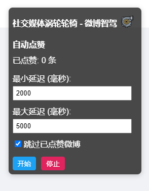

社交媒体动涡轮轮椅 
-----------------

by karminski-牙医

## Desc 

该项目定位是一个简单的社交媒体自动运维脚本

目前适配版本有:

### 微博智驾

微博自动点赞油猴脚本, 适用于微博网页版的如下页面:

- @我的 [https://weibo.com/at/weibo](https://weibo.com/at/weibo)
- 评论 [https://weibo.com/comment/inbox](https://weibo.com/comment/inbox)

**使用说明**

1. 安装油猴脚本 Chrome 插件
2. 将src目录中的脚本粘贴进去
3. 打开微博网页版, 点击开始即可开始自动点赞
4. 注意不会自动停止, 需要手动停止

## License

[MIT](./LICENSE)

